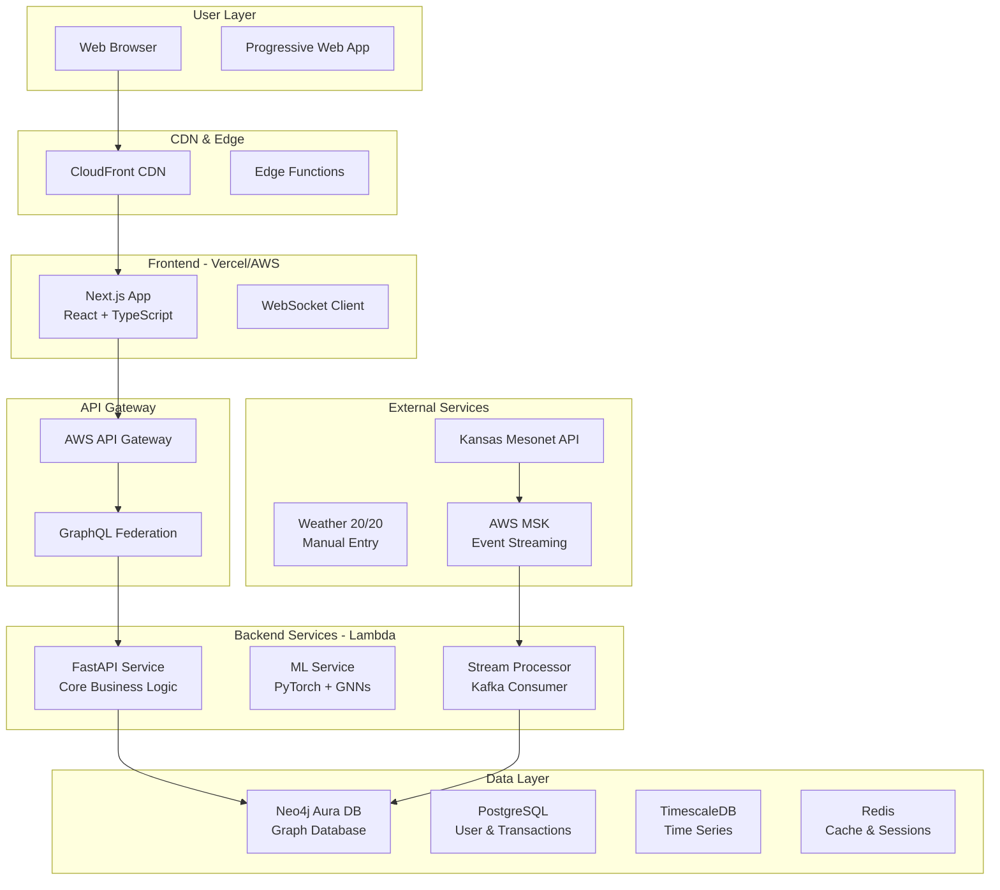

# FarmCalc Full-Stack Architecture Document

**Version:** 1.1  
**Date:** 2025-08-21  
**Author:** Winston (Architect)  
**Status:** ✅ COMPLETE - Ready for Implementation

## Introduction

This document outlines the complete fullstack architecture for FarmCalc, including backend systems, frontend implementation, and their integration. It serves as the single source of truth for AI-driven development, ensuring consistency across the entire technology stack.

This unified approach combines what would traditionally be separate backend and frontend architecture documents, streamlining the development process for modern fullstack applications where these concerns are increasingly intertwined.

### Starter Template or Existing Project

**Status:** N/A - Greenfield project

**Recommendation:** Custom monorepo setup with Turborepo for optimal control over Neo4j integration and graph-centric design.

### Change Log

| Date | Version | Description | Author |
|------|---------|-------------|--------|
| 2025-08-21 | v1.0 | Initial architecture document creation | Winston (Architect) |
| 2025-08-21 | v1.1 | Fixed version conflicts, added missing dependencies | Winston (Architect) |

## High Level Architecture

### Technical Summary

FarmCalc employs a graph-centric serverless architecture with Neo4j Aura DB as the primary database, React/Next.js for the frontend, and FastAPI for backend services. The platform integrates frontend and backend through GraphQL federation and real-time WebSocket connections for graph updates. Infrastructure leverages AWS Lambda for compute, S3 for storage, Kafka for event streaming, and CloudFront for global content delivery. This architecture directly supports the PRD's goal of modeling agriculture as an interconnected system, enabling network effects and collaborative intelligence through graph algorithms while maintaining <100ms query response times for 3-hop traversals.

### Platform and Infrastructure Choice

**Platform:** AWS Full Stack  
**Key Services:** Lambda, API Gateway, S3, CloudFront, SageMaker, MSK (Kafka), Secrets Manager  
**Deployment Regions:** us-west-2 (primary), us-central-1 (DR)

### Repository Structure

**Structure:** Monorepo using Turborepo  
**Monorepo Tool:** Turborepo (optimal for Next.js + FastAPI)  
**Package Organization:** Apps (web, api, ml-service), Packages (shared, ui, graph-sdk), Infrastructure (CDK)

### High Level Architecture Diagram



### Architectural Patterns

## MVP Implementation Reference

The PRD Section 3 contains the complete MVP implementation plan including:
- 5 Epics with 10 user stories
- Simplified 10-requirement scope for Phase 1a
- Basic CI/CD pipeline configuration
- Database migration approach
- Local development setup instructions

### Quick Start for Developers

```bash
# Clone and setup
git clone https://github.com/americanagrionics/farmcalc
cd farmcalc
npm install
docker-compose up -d

# Run development servers
npm run dev

# Deploy to staging
git push origin main  # Auto-deploys via GitHub Actions
```

### Database Setup

Neo4j Aura DB:
- Use free tier for MVP (50K nodes, 175K relationships)
- Connection via Bolt protocol
- Migrations in `/migrations/neo4j/`

PostgreSQL:
- Docker locally, RDS in production
- Minimal schema for users and audit
- Migrations via simple SQL scripts

### Deployment Architecture (Simplified for MVP)

- **Frontend:** Vercel (automatic from GitHub)
- **API:** Single AWS Lambda function
- **Database:** Neo4j Aura DB (managed)
- **Auth:** Simple JWT (upgrade to Cognito later)
- **CI/CD:** GitHub Actions (test and deploy on push to main)

- **Jamstack Architecture:** Static generation with Next.js, serverless APIs via Lambda - *Rationale:* Optimal performance with <50ms TTFB
- **Graph-First Data Modeling:** All relationships modeled in Neo4j, SQL only for transactions - *Rationale:* Native graph operations 100x faster than SQL joins
- **Event-Driven Architecture:** Kafka streams for real-time weather and field updates - *Rationale:* Decouples data ingestion from processing
- **Backend for Frontend (BFF):** GraphQL layer aggregates multiple services - *Rationale:* Single API surface for frontend
- **Repository Pattern:** Abstract Neo4j and PostgreSQL access - *Rationale:* Testability and future flexibility
- **Component-Based UI:** Atomic design with React + TypeScript - *Rationale:* Reusability and type safety
- **CQRS Pattern:** Separate read models from write models - *Rationale:* Optimize for different access patterns
- **Microservices with Bounded Contexts:** Separate ML, Core API, Stream services - *Rationale:* Independent scaling

## Tech Stack

### Core Technologies

| Category | Technology | Version | Purpose | Rationale |
|----------|------------|---------|---------|-----------|
| Runtime | Node.js | 20.x LTS | JavaScript runtime | Required for Next.js 14, native ESM support |
| Frontend Language | TypeScript | 5.5.4 | Type-safe frontend development | Prevents runtime errors in complex graph interactions |
| UI Library | React | 18.3.1 | Component-based UI | Required by Next.js, concurrent features |
| Frontend Framework | Next.js | 14.2.5 | React framework with SSR/SSG | Optimal SEO, API routes, App Router |
| UI Component Library | Material-UI (MUI) | 5.16.7 | Comprehensive component set | Accessible components, theming |
| State Management | Zustand | 4.5.5 | Lightweight state management | Simple API, TypeScript-first |
| GraphQL Client | Apollo Client | 3.10.8 | GraphQL client with caching | Optimistic UI, subscriptions, caching |
| Backend Language | Python | 3.12.4 | Backend services and ML | Best ML ecosystem, Neo4j maturity |
| Backend Framework | FastAPI | 0.112.0 | High-performance API framework | Async support, automatic docs |
| API Style | GraphQL | 16.9.0 | Flexible data fetching | Efficient graph queries, subscriptions |
| Database | Neo4j Aura DB | 5.x | Primary graph database | Purpose-built for relationships |
| Cache | Redis | 7.2.5 | Session and query cache | Sub-ms latency, PubSub |
| File Storage | AWS S3 | - | Object storage | Infinite scale, lifecycle policies |
| Authentication | AWS Cognito | - | Managed auth service | MFA support, social logins |
| Build Tool | Turborepo | 2.0.9 | Monorepo orchestration | Incremental builds, remote caching |
| Component Dev | Vite | 5.3.5 | Component library bundler only | Fast HMR for UI package development |
| IaC Tool | AWS CDK | 2.150.0 | Infrastructure as Code | Type-safe, CloudFormation output |
| CI/CD | GitHub Actions | - | Continuous Integration | Native GitHub integration |
| Monitoring | DataDog | - | APM and logging | Distributed tracing, metrics |
| Logging | AWS CloudWatch | - | Centralized logging | Native AWS integration |
| CSS Framework | Tailwind CSS | 3.4.7 | Utility-first CSS | Consistent spacing, tree-shaking |

### Backend Dependencies

| Category | Technology | Version | Purpose | Rationale |
|----------|------------|---------|---------|-----------|
| Graph Driver | neo4j-driver | 5.24.0 | Neo4j Python driver | Async support, connection pooling |
| PostgreSQL Driver | asyncpg | 0.29.0 | Async PostgreSQL driver | High performance async queries |
| ML Framework | scikit-learn | 1.5.1 | Traditional ML models | Random forests, preprocessing |
| Deep Learning | PyTorch | 2.4.0 | Neural networks & GNNs | Graph neural networks support |
| ML Lifecycle | MLflow | 2.15.1 | Model versioning & tracking | Experiment tracking, model registry |
| Data Processing | pandas | 2.2.2 | Data manipulation | Time series, CSV processing |
| HTTP Client | httpx | 0.27.0 | Async HTTP client | External API integration |
| Validation | Pydantic | 2.8.2 | Data validation | FastAPI integration, type safety |

### Testing Frameworks

| Category | Technology | Version | Purpose | Rationale |
|----------|------------|---------|---------|-----------|
| Frontend Testing | Vitest | 2.0.5 | Component testing | Fast, ESM native, Jest compatible |
| React Testing | Testing Library | 16.0.0 | React component testing | User-centric testing approach |
| Backend Testing | pytest | 8.3.2 | Python testing framework | Fixtures, async support |
| E2E Testing | Playwright | 1.45.3 | Cross-browser testing | Reliable selectors, visual regression |
| API Testing | Supertest | 7.0.0 | API endpoint testing | HTTP assertions, async support |

## Data Models

### Farm
**Purpose:** Represents a farming operation with multiple fields

**TypeScript Interface:**
```typescript
interface Farm {
  id: string;
  name: string;
  ownerId: string;
  location: {
    type: 'Point';
    coordinates: [number, number];
  };
  totalAcres: number;
  createdAt: Date;
  preferences: {
    riskTolerance: 'conservative' | 'moderate' | 'aggressive';
    primaryCrops: string[];
    equipmentInventory: string[];
  };
}
```

### Field
**Purpose:** Individual field with boundaries and rotation history

**TypeScript Interface:**
```typescript
interface Field {
  id: string;
  farmId: string;
  name: string;
  boundary: {
    type: 'Polygon';
    coordinates: number[][][];
  };
  acres: number;
  soilType: string;
  currentCrop?: string;
  currentMoisture?: number;
  lastUpdated: Date;
}
```

### Additional Core Models
- **Crop:** Varieties with agronomic properties
- **Season:** Links fields to crops for specific years
- **Treatment:** Agricultural inputs (herbicides, fertilizers)
- **WeatherEvent:** Weather observations affecting operations

## API Specification

### GraphQL Schema (Excerpt)

```graphql
type Query {
  farm(id: ID!): Farm
  farms(ownerId: ID!): [Farm!]!
  field(id: ID!): Field
  fields(farmId: ID!): [Field!]!
  optimizeRotation(constraints: RotationConstraints!): RotationPlan!
  predictYield(fieldId: ID!, cropId: ID!, plantingDate: DateTime!): YieldPrediction!
  checkHerbicideRestrictions(fieldId: ID!, cropId: ID!): [RestrictionViolation!]!
}

type Mutation {
  createFarm(input: CreateFarmInput!): Farm!
  createField(input: CreateFieldInput!): Field!
  createTreatment(input: CreateTreatmentInput!): Treatment!
  plantCrop(fieldId: ID!, cropId: ID!, plantingDate: DateTime!): Season!
}

type Subscription {
  fieldUpdated(fieldId: ID!): Field!
  weatherAlert(farmId: ID!, severity: Severity!): WeatherAlert!
}
```

## Database Schema

### Neo4j Aura DB (Primary)

```cypher
// Core constraints
CREATE CONSTRAINT farm_id IF NOT EXISTS FOR (f:Farm) REQUIRE f.id IS UNIQUE;
CREATE CONSTRAINT field_id IF NOT EXISTS FOR (f:Field) REQUIRE f.id IS UNIQUE;

// Core relationships
(:Farm)-[:HAS_FIELD]->(:Field)
(:Field)-[:ADJACENT_TO {distance: Float}]->(:Field)
(:Field)-[:PLANTED {date: Date, population: Integer}]->(:Crop)
(:Treatment)-[:RESTRICTS {months: Integer}]->(:Crop)
```

### PostgreSQL (User Management)

```sql
CREATE TABLE users (
    id UUID PRIMARY KEY DEFAULT gen_random_uuid(),
    cognito_id VARCHAR(255) UNIQUE NOT NULL,
    email VARCHAR(255) UNIQUE NOT NULL,
    name VARCHAR(255) NOT NULL,
    role VARCHAR(50) DEFAULT 'farmer',
    created_at TIMESTAMP DEFAULT CURRENT_TIMESTAMP
);
```

## Deployment Architecture

**Frontend:** AWS CloudFront + S3  
**Backend:** AWS Lambda + API Gateway  
**CI/CD:** GitHub Actions with automated testing and deployment

### Environments

| Environment | Frontend URL | Backend URL | Purpose |
|------------|--------------|-------------|---------|
| Development | http://localhost:3000 | http://localhost:4000 | Local development |
| Staging | https://staging.farmcalc.app | https://api-staging.farmcalc.app | Pre-production testing |
| Production | https://farmcalc.app | https://api.farmcalc.app | Live environment |

## Security & Performance

### Security Requirements
- **CSP Headers:** Strict content security policy
- **Input Validation:** Pydantic + Zod schemas
- **Rate Limiting:** 100 req/min per IP
- **Token Management:** 15-min access, 7-day refresh

### Performance Targets
- **Bundle Size:** <200KB initial JS
- **Response Time:** p95 <500ms
- **Database:** Connection pooling, query caching
- **CDN:** CloudFront with 1-year cache for static assets

## Critical Implementation Standards

### No Unauthorized Fallbacks
- ALL development must use real APIs and actual data sources
- Mock data only with explicit written approval
- No automatic fallbacks without user consent
- Real data requirements enforced at all levels

### Coding Standards
- **Type Sharing:** Always use packages/shared for types
- **API Calls:** Never direct HTTP - use service layer
- **Environment Variables:** Access through config objects only
- **Graph Queries:** Parameterized statements only
- **Herbicide Validation:** Always check plant-back restrictions

## Testing Strategy

- **Unit Tests:** 70% of tests (frontend + backend)
- **Integration Tests:** 25% covering critical paths
- **E2E Tests:** 5% for user journeys
- **Coverage Target:** 80%+ for business logic

## Monitoring & Observability

- **Frontend:** Sentry, Web Vitals
- **Backend:** CloudWatch, X-Ray
- **APM:** DataDog end-to-end tracing
- **Key Metrics:** Core Web Vitals, p95 latency, error rates

## Next Steps

1. **Neo4j Aura Setup:** Provision Professional instance in US-Central
2. **Repository Initialization:** Create monorepo with Turborepo
3. **Environment Configuration:** Set up AWS accounts and services
4. **Team Onboarding:** Review architecture with development team
5. **Sprint 1 Start:** Begin Epic 1 (Foundation & Graph Infrastructure)

---

*This architecture document is the definitive technical guide for FarmCalc development. All implementation must align with these specifications.*