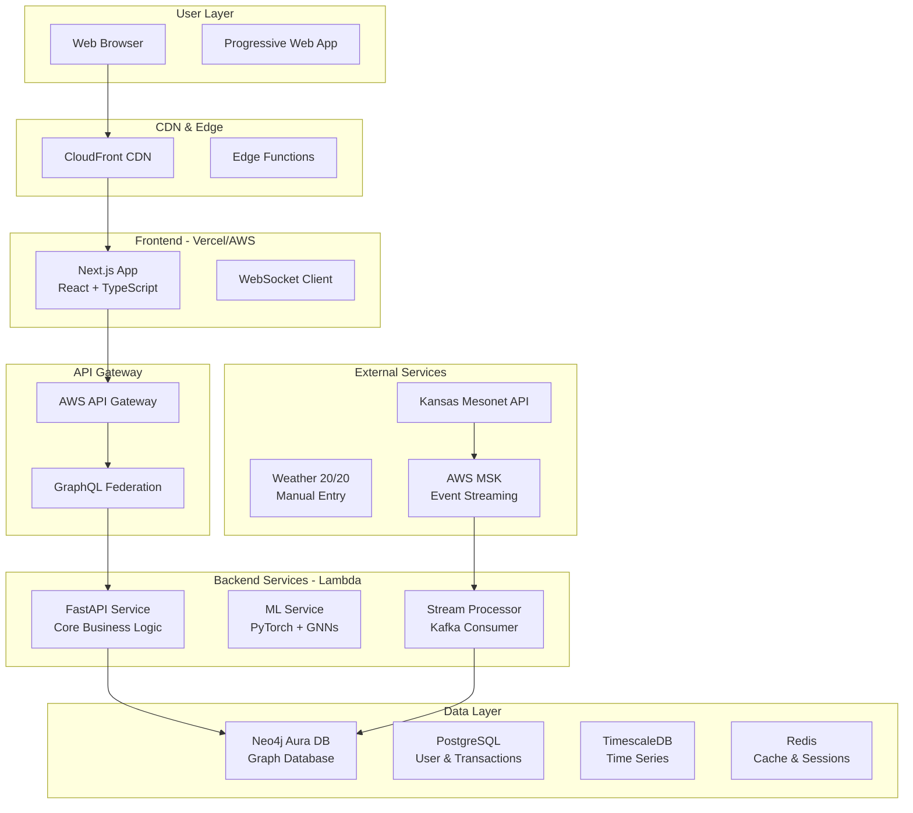

# High Level Architecture

## Technical Summary

FarmCalc employs a graph-centric serverless architecture with Neo4j Aura DB as the primary database, React/Next.js for the frontend, and FastAPI for backend services. The platform integrates frontend and backend through GraphQL federation and real-time WebSocket connections for graph updates. Infrastructure leverages AWS Lambda for compute, S3 for storage, Kafka for event streaming, and CloudFront for global content delivery. This architecture directly supports the PRD's goal of modeling agriculture as an interconnected system, enabling network effects and collaborative intelligence through graph algorithms while maintaining <100ms query response times for 3-hop traversals.

## Platform and Infrastructure Choice

**Platform:** AWS Full Stack  
**Key Services:** Lambda, API Gateway, S3, CloudFront, SageMaker, MSK (Kafka), Secrets Manager  
**Deployment Regions:** us-west-2 (primary), us-central-1 (DR)

## Repository Structure

**Structure:** Monorepo using Turborepo  
**Monorepo Tool:** Turborepo (optimal for Next.js + FastAPI)  
**Package Organization:** Apps (web, api, ml-service), Packages (shared, ui, graph-sdk), Infrastructure (CDK)

## High Level Architecture Diagram

## Architectural Patterns
